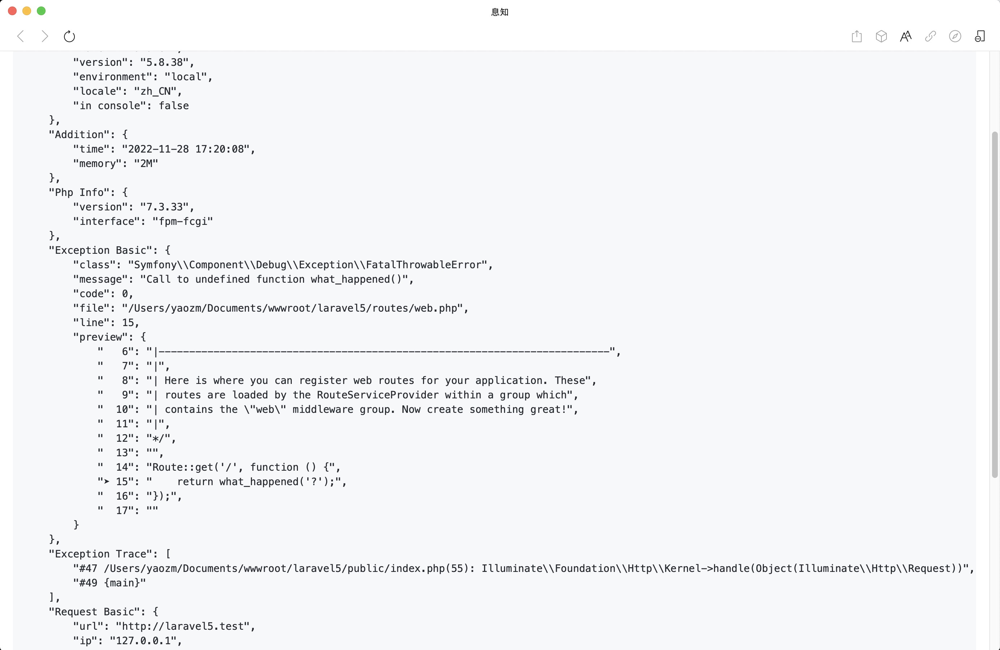

# laravel-exception-notify

[简体中文](README.md) | [ENGLISH](README-EN.md)

> Exception monitoring alarm notification in Laravel(Bark、Chanify、DingTalk、Discord、FeiShu、Mail、PushDeer、QQ Channel Bot、ServerChan、Slack、Telegram、WeWork、XiZhi).

[](https://github.com/guanguans/laravel-exception-notify/actions)
[](https://github.com/guanguans/laravel-exception-notify/actions)
[](https://codecov.io/gh/guanguans/laravel-exception-notify)
[](//packagist.org/packages/guanguans/laravel-exception-notify)
[](//packagist.org/packages/guanguans/laravel-exception-notify)
[](//packagist.org/packages/guanguans/laravel-exception-notify)

## Feature

* Monitor and send laravel application exception
* Support multiple channels(Bark、Chanify、DingTalk、Discord、FeiShu、Mail、PushDeer、ServerChan、Slack、Telegram、WeWork、XiZhi)
* Support for extended custom channels
* Support for custom data collectors
* Support for custom data transformers
* Support notification rate limit(The production environment with the same exception will be notified every 5 minutes by default)

## Related Links

* [https://github.com/guanguans/notify](https://github.com/guanguans/notify)
* [https://github.com/guanguans/yii-log-target](https://github.com/guanguans/yii-log-target)

## Requirement

* PHP >= 7.2
* laravel >= 5.5

## Installation

```bash
composer require guanguans/laravel-exception-notify -vvv
```

## Configuration

### Register service

#### laravel

```bash
php artisan vendor:publish --provider="Guanguans\\LaravelExceptionNotify\\ExceptionNotifyServiceProvider"
```

#### lumen

Add the following snippet to the `bootstrap/app.php` file under the `Register Service Providers` section as follows:

```php
$app->register(\Guanguans\LaravelExceptionNotify\ExceptionNotifyServiceProvider::class);
$app->boot(\Guanguans\LaravelExceptionNotify\ExceptionNotifyServiceProvider::class);
```

### Apply for channel `token` and other information

* [Bark](https://github.com/Finb/Bark)
* [Chanify](https://github.com/chanify?type=source)
* [Dingtalk](https://developers.dingtalk.com/document/app/custom-robot-access)
* [Discord](https://discord.com/developers/docs/resources/webhook#edit-webhook-message)
* [Feishu](https://www.feishu.cn/hc/zh-CN/articles/360024984973)
* [PushDeer](http://pushdeer.com)
* [QQ Channel Bot](https://bot.q.qq.com/wiki/develop/api/openapi/message/post_messages.html)
* [ServerChan](https://sct.ftqq.com)
* [Slack](https://api.slack.com/messaging/webhooks)
* [Telegram](https://core.telegram.org/bots/api#sendmessage)
* [WeWork](https://work.weixin.qq.com/help?doc_id=13376)
* [XiZhi](https://xz.qqoq.net/#/index)

### Configure `token` and other information in the configuration file

`config/exception-notify.php`

Configure in the `.env` file

```dotenv
EXCEPTION_NOTIFY_DEFAULT_CHANNEL=dingTalk
EXCEPTION_NOTIFY_DINGTALK_KEYWORD=keyword
EXCEPTION_NOTIFY_DINGTALK_TOKEN=c44fec1ddaa8a833156efb77b7865d62ae13775418030d94d
EXCEPTION_NOTIFY_DINGTALK_SECRET=SECc32bb7345c0f73da2b9786f0f7dd5083bd768a29b82
```

## Usage

### Modify the `report` method in the `app/Exceptions/Handler.php` file

```php
public function report(Exception $e)
{
    // 默认通道
    \ExceptionNotifier::reportIf($this->shouldReport($e), $e);
    // 指定通道
    \ExceptionNotifier::onChannel('dingTalk', 'mail')->reportIf($this->shouldReport($e), $e);

    parent::report($e);
}
```

### Notification result(Xi Zhi)



## Extend custom channel

Modify the `boot` method in the `app/Providers/AppServiceProvider.php` file

```php
public function boot()
{
    // Extend custom channel
    \ExceptionNotifier::extend('YourChannel', function (\Illuminate\Contracts\Container\Container $container){
        // return instance of the `\Guanguans\LaravelExceptionNotify\Contracts\Channel`.          
    });
}
```

## Testing

```bash
composer test
```

## Changelog

Please see [CHANGELOG](CHANGELOG.md) for more information on what has changed recently.

## Contributing

Please see [CONTRIBUTING](.github/CONTRIBUTING.md) for details.

## Security Vulnerabilities

Please review [our security policy](../../security/policy) on how to report security vulnerabilities.

## Credits

* [guanguans](https://github.com/guanguans)
* [All Contributors](../../contributors)

## Thanks

[](https://www.jetbrains.com/?from=https://github.com/guanguans)

## License

The MIT License (MIT). Please see [License File](LICENSE) for more information.
