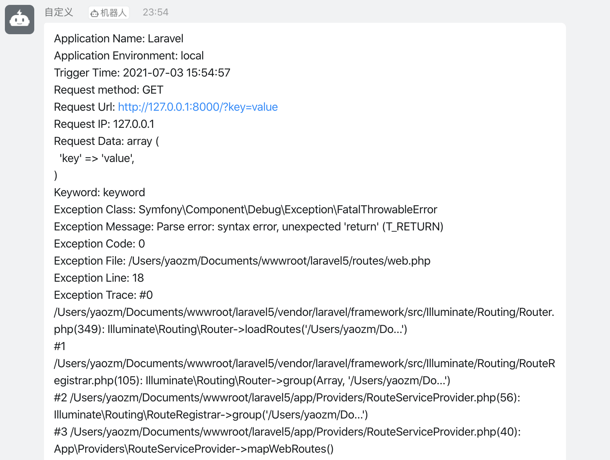
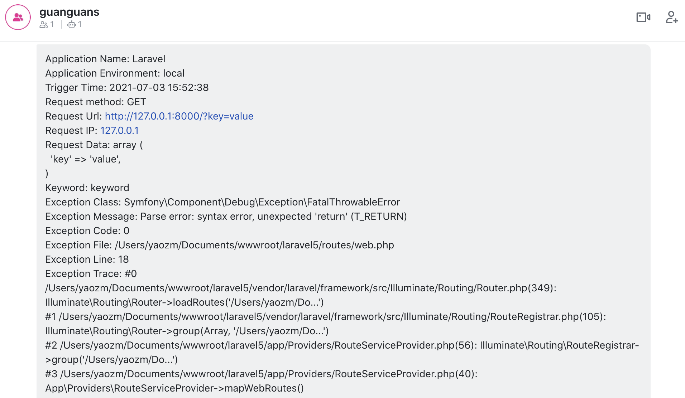
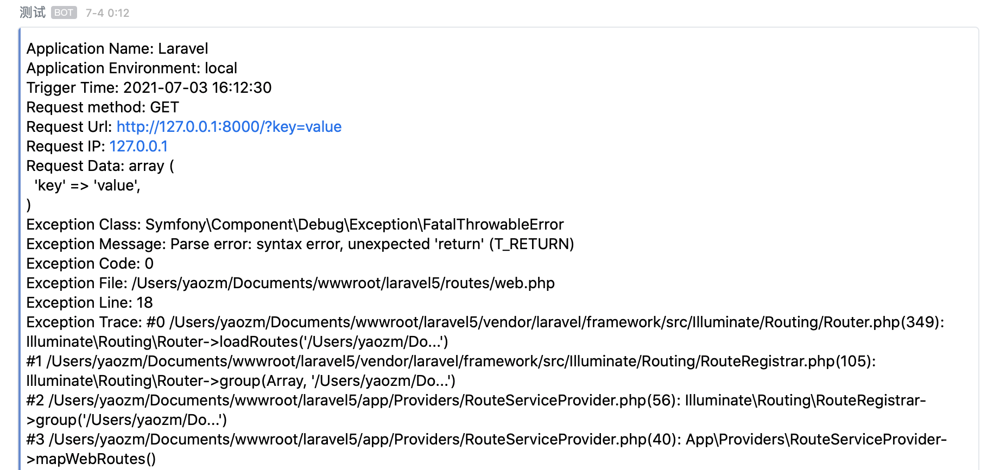
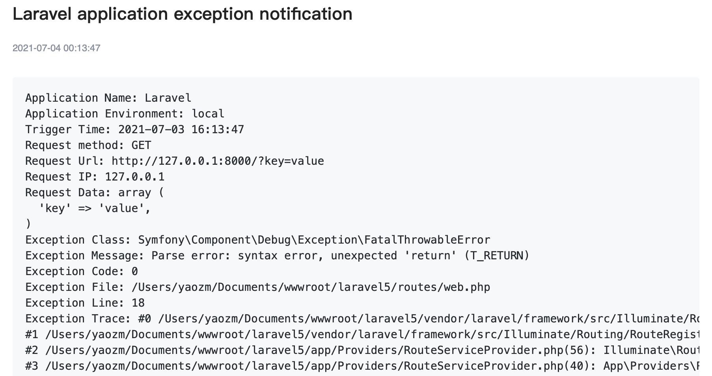

# laravel-exception-notify

[简体中文](README.md) | [ENGLISH](README-EN.md)

> Multiple channels of laravel exception notification(DingTalk、FeiShu、ServerChan、WeWork、XiZhi). - 多种通道的 laravel 异常通知(钉钉群机器人、飞书群机器人、Server 酱、企业微信群机器人、息知)。

[](https://github.com/guanguans/laravel-exception-notify/actions)
[](https://github.com/guanguans/laravel-exception-notify/actions)
[](https://codecov.io/gh/guanguans/laravel-exception-notify)
[](//packagist.org/packages/guanguans/laravel-exception-notify)
[](//packagist.org/packages/guanguans/laravel-exception-notify)
[](//packagist.org/packages/guanguans/laravel-exception-notify)

## Feature

* Monitor and send laravel application exception
* Support multiple channels(DingTalk、FeiShu、ServerChan、WeWork、XiZhi)
* Customize the abnormal information data sent

## Related Links

* [https://github.com/guanguans/notify](https://github.com/guanguans/notify)
* [https://github.com/guanguans/yii-log-target](https://github.com/guanguans/yii-log-target)

## Requirement

* laravel >= 5.5

## Installation

```bash
$ composer require guanguans/laravel-exception-notify -vvv
```

## Configuration

### Register service

#### laravel

```bash
$ php artisan vendor:publish --provider="Guanguans\\LaravelExceptionNotify\\ExceptionNotifyServiceProvider"
```

#### lumen

Add the following snippet to the `bootstrap/app.php` file under the `Register Service Providers` section as follows:

```php
$app->register(\Guanguans\LaravelExceptionNotify\ExceptionNotifyServiceProvider::class);
```

### Apply for channel `token` and other information

* [Dingtalk](https://developers.dingtalk.com/document/app/custom-robot-access)
* [Feishu](https://www.feishu.cn/hc/zh-CN/articles/360024984973)
* [ServerChan](https://sct.ftqq.com)
* [WeWork](https://work.weixin.qq.com/help?doc_id=13376)
* [XiZhi](https://xz.qqoq.net/#/index)

### Configure `token` and other information in the configuration file

`config/exception-notify.php`

Configure in the `.env` file

```dotenv
EXCEPTION_NOTIFY_DEFAULT_CHANNEL=dingTalk
EXCEPTION_NOTIFY_CHANNEL_KEYWORD=keyword
EXCEPTION_NOTIFY_CHANNEL_TOKEN=fec1ddaa8a833156efb77b7865d62ae13775418030d94d05da08bfca73eeb
EXCEPTION_NOTIFY_CHANNEL_SECRET=c32bb7345c0f73da2b9786f0f7dd5083bd768a29b82e6d460149d730eee51730
```

## Usage

### Modify the `report` method in the `app/Exceptions/Handler.php` file

```php
public function report(Exception $exception)
{
    // Added code
    $this->shouldReport($exception) and \ExceptionNotifier::report($exception);
    // // OR
    // $this->shouldReport($exception) and app('exception.notifier')->report($exception);
    // // OR
    // $this->shouldReport($exception) and \Guanguans\LaravelExceptionNotify\Facades\Notifier::report($exception);

    parent::report($exception);
}
```

### Notification result









## Testing

```bash
$ composer test
```

## Changelog

Please see [CHANGELOG](CHANGELOG.md) for more information on what has changed recently.

## Contributing

Please see [CONTRIBUTING](.github/CONTRIBUTING.md) for details.

## Security Vulnerabilities

Please review [our security policy](../../security/policy) on how to report security vulnerabilities.

## Credits

* [guanguans](https://github.com/guanguans)
* [All Contributors](../../contributors)

## License

The MIT License (MIT). Please see [License File](LICENSE) for more information.
