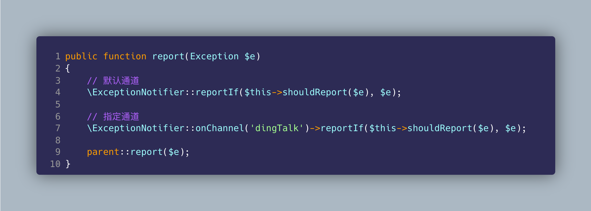

# laravel-exception-notify



[简体中文](README.md) | [ENGLISH](README-EN.md)

> Laravel 中异常监控报警通知(Bark、Chanify、钉钉群机器人、Discord、飞书群机器人、邮件、PushDeer、QQ 频道机器人、Server 酱、Slack、Telegram、企业微信群机器人、息知)。

[](https://github.com/guanguans/laravel-exception-notify/actions)
[](https://github.com/guanguans/laravel-exception-notify/actions)
[](https://codecov.io/gh/guanguans/laravel-exception-notify)
[](//packagist.org/packages/guanguans/laravel-exception-notify)
[](//packagist.org/packages/guanguans/laravel-exception-notify)
[](//packagist.org/packages/guanguans/laravel-exception-notify)

## 功能

* 监控发送 laravel 应用异常
* 支持多种通道(Bark、Chanify、钉钉群机器人、Discord、飞书群机器人、邮件、PushDeer、QQ 频道机器人、Server 酱、Slack、Telegram、企业微信群机器人、息知)
* 支持扩展自定义通道
* 支持自定义数据收集器
* 支持自定义数据转换器
* 支持通知速率限制(相同异常生产环境默认每 5 分钟通知 1 次)

## 相关项目

* [https://github.com/guanguans/notify](https://github.com/guanguans/notify)
* [https://github.com/guanguans/yii-log-target](https://github.com/guanguans/yii-log-target)

## 环境要求

* PHP >= 7.2
* laravel >= 5.5

## 安装

```bash
composer require guanguans/laravel-exception-notify -vvv
```

## 配置

### 注册服务

#### laravel

```bash
php artisan vendor:publish --provider="Guanguans\\LaravelExceptionNotify\\ExceptionNotifyServiceProvider"
```

#### lumen

将以下代码段添加到 `bootstrap/app.php` 文件中的 `Register Service Providers` 部分下：

```php
$app->register(\Guanguans\LaravelExceptionNotify\ExceptionNotifyServiceProvider::class);
$app->boot(\Guanguans\LaravelExceptionNotify\ExceptionNotifyServiceProvider::class);
```

### 申请通道 token 等信息

* [Bark](https://github.com/Finb/Bark)
* [Chanify](https://github.com/chanify?type=source)
* [钉钉群机器人](https://developers.dingtalk.com/document/app/custom-robot-access)
* [Discord](https://discord.com/developers/docs/resources/webhook#edit-webhook-message)
* [飞书群机器人](https://www.feishu.cn/hc/zh-CN/articles/360024984973)
* [PushDeer](http://pushdeer.com)
* [QQ 频道机器人](https://bot.q.qq.com/wiki/develop/api/openapi/message/post_messages.html)
* [Server 酱](https://sct.ftqq.com)
* [Slack](https://api.slack.com/messaging/webhooks)
* [Telegram](https://core.telegram.org/bots/api#sendmessage)
* [企业微信群机器人](https://work.weixin.qq.com/help?doc_id=13376)
* [息知](https://xz.qqoq.net/#/index)

### 配置文件中配置 token 等信息

`config/exception-notify.php`

`.env` 文件中配置

```dotenv
EXCEPTION_NOTIFY_DEFAULT_CHANNEL=dingTalk
EXCEPTION_NOTIFY_DINGTALK_KEYWORD=keyword
EXCEPTION_NOTIFY_DINGTALK_TOKEN=c44fec1ddaa8a833156efb77b7865d62ae13775418030d94d
EXCEPTION_NOTIFY_DINGTALK_SECRET=SECc32bb7345c0f73da2b9786f0f7dd5083bd768a29b82
```

## 使用

### `app/Exceptions/Handler.php` 的 `report` 方法中添加

```php
public function report(Exception $e)
{
    // 默认通道
    \ExceptionNotifier::reportIf($this->shouldReport($e), $e);
    // 指定通道
    \ExceptionNotifier::onChannel('dingTalk', 'mail')->reportIf($this->shouldReport($e), $e);

    parent::report($e);
}
```

### 通知结果(息知)


## 扩展自定义通道

`app/Providers/AppServiceProvider.php` 的 `boot` 方法中添加

```php
public function boot()
{
    // 扩展自定义通道
    \ExceptionNotifier::extend('YourChannel', function (\Illuminate\Contracts\Container\Container $container){
        // 返回 \Guanguans\LaravelExceptionNotify\Contracts\Channel 的实例          
    });
}
```

## 测试

```bash
composer test
```

## 变更日志

请参阅 [CHANGELOG](CHANGELOG.md) 获取最近有关更改的更多信息。

## 贡献指南

请参阅 [CONTRIBUTING](.github/CONTRIBUTING.md) 有关详细信息。

## 安全漏洞

请查看[我们的安全政策](../../security/policy)了解如何报告安全漏洞。

## 贡献者

* [guanguans](https://github.com/guanguans)
* [所有贡献者](../../contributors)

## 鸣谢

[](https://www.jetbrains.com/?from=https://github.com/guanguans)

## 协议

MIT 许可证（MIT）。有关更多信息，请参见[协议文件](LICENSE)。
