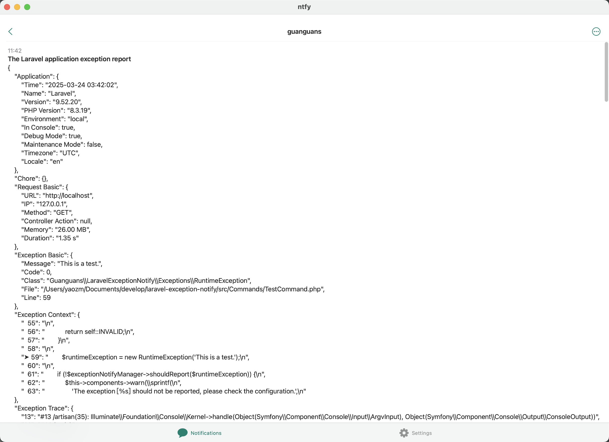
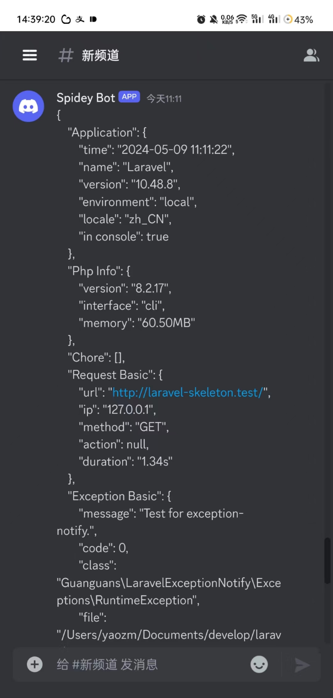
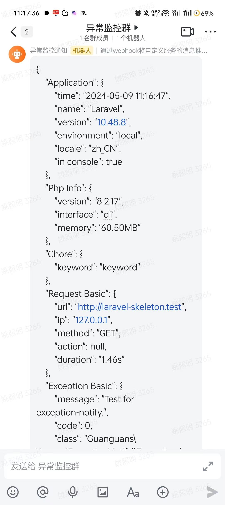

# laravel-exception-notify

<p align="center"></p>

> Monitor exception and report to the notification channels(Dump、Log、Mail、AnPush、Bark、Chanify、DingTalk、Discord、Gitter、GoogleChat、IGot、Lark、Mattermost、MicrosoftTeams、NowPush、Ntfy、Push、Pushback、PushBullet、PushDeer、PushMe、Pushover、PushPlus、QQ、RocketChat、ServerChan、ShowdocPush、SimplePush、Slack、Telegram、WeWork、WPush、XiZhi、YiFengChuanHua、Zulip).

[](https://github.com/guanguans/laravel-exception-notify/actions)
[](https://github.com/guanguans/laravel-exception-notify/actions)
[](https://codecov.io/gh/guanguans/laravel-exception-notify)
[](https://packagist.org/packages/guanguans/laravel-exception-notify)
[](https://github.com/guanguans/laravel-exception-notify/releases)
[](https://packagist.org/packages/guanguans/laravel-exception-notify)
[](https://packagist.org/packages/guanguans/laravel-exception-notify)

## Related Links

* [https://github.com/guanguans/notify](https://github.com/guanguans/notify)
* [https://github.com/guanguans/yii-log-target](https://github.com/guanguans/yii-log-target)

## Requirement

* PHP >= 8.0

## Installation

```bash
composer require guanguans/laravel-exception-notify --ansi -v
```

## Configuration

### Publish files(optional)

```bash
php artisan vendor:publish --provider="Guanguans\\LaravelExceptionNotify\\ExceptionNotifyServiceProvider" --ansi -v
```

### Apply for channel authentication information

* [Notify(30+)](https://github.com/guanguans/notify)
* Dump(for debugging exception report)
* Log
* Mail

### Configure channels in the `config/exception-notify.php` and `.env` file

```dotenv
EXCEPTION_NOTIFY_CHANNEL=stack
EXCEPTION_NOTIFY_STACK_CHANNELS=log,slack,weWork
EXCEPTION_NOTIFY_SLACK_WEBHOOK=https://hooks.slack.com/services/TPU9A9/B038KNUC0GY/6pKH3vfa3mjlUPcgLSjzR
EXCEPTION_NOTIFY_WEWORK_TOKEN=73a3d5a3-ceff-4da8-bcf3-ff5891778
```

## Usage

### Testing for exception notify

```shell
php artisan exception-notify:test --ansi -v
```

### :camera_flash: Notification examples

<details>
<summary>:monocle_face: details</summary>

|           discord            |          slack           |            telegram            |
|:----------------------------:|:------------------------:|:------------------------------:|
|  |  |  |
|             lark             |           mail           |             weWork             |
|        |    |      |

</details>

### Skip report

Modify the `boot` method in the `app/Providers/AppServiceProvider.php` file

```php
<?php

use Guanguans\LaravelExceptionNotify\Facades\ExceptionNotify;
use Illuminate\Support\Arr;

public function boot(): void
{
    ExceptionNotify::skipWhen(static fn (\Throwable $throwable) => Arr::first(
        [
            \Symfony\Component\HttpKernel\Exception\HttpException::class,
            \Illuminate\Http\Exceptions\HttpResponseException::class,
        ],
        static fn (string $exception): bool => $throwable instanceof $exception
    ));
}
```

### Extend channel

Modify the `boot` method in the `app/Providers/AppServiceProvider.php` file

```php
<?php

use Guanguans\LaravelExceptionNotify\Contracts\ChannelContract;
use Guanguans\LaravelExceptionNotify\Facades\ExceptionNotify;
use Illuminate\Container\Container;

public function boot(): void
{
    ExceptionNotify::extend('YourChannelName', function (Container $container): ChannelContract {
        return 'Instance of the `Guanguans\LaravelExceptionNotify\Contracts\ChannelContract`.';
    });
}
```

## Testing

```bash
composer test
```

## Changelog

Please see [CHANGELOG](CHANGELOG.md) for more information on what has changed recently.

## Contributing

Please see [CONTRIBUTING](.github/CONTRIBUTING.md) for details.

## Security Vulnerabilities

Please review [our security policy](../../security/policy) on how to report security vulnerabilities.

## Credits

* [guanguans](https://github.com/guanguans)
* [All Contributors](../../contributors)

## Thanks

[](https://www.jetbrains.com/?from=https://github.com/guanguans)

## License

The MIT License (MIT). Please see [License File](LICENSE) for more information.
